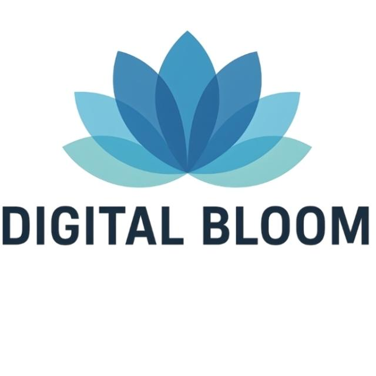

<!-- HEADER BANNER -->
<div align="center">



# DigitalBloom Platform
### *QR-Driven Marketing, Communication & AI Engagement — Anywhere, Anytime*

**Developed by [Stratetactical Solutions Limited (STL)](mailto:stratetacticallimited@gmail.com) · Kenya**

<a href="./LICENCE"></a>
<a href="./RELEASES.md"></a>
<a href="./SUPPORT.md"></a>
<a href="https://github.com/awesomeerictech/DigitalBloom/releases"></a>
<a href=""></a>

---

> *"DigitalBloom turns any physical space into a live digital marketing experience — without requiring your customer to install a single app."*
>
> — **Mr. Eric Muhoro Muchiri**, CTO & AI Engineer, Stratetactical Solutions Limited

</div>

---

## 🌸 What is DigitalBloom Platform?

**DigitalBloom** is a **cross-platform marketing, communication, and AI engagement platform** for anyone who sells products or services, educates communities, or delivers digital experiences in low-connectivity environments.

It is not an ERP. It does not manage accounting, inventory, or internal enterprise workflows. Its sole focus is **customer-facing marketing, communication, engagement, and AI-powered digital experiences** — delivered through QR codes, local networks, embedded devices, and cloud infrastructure.

DigitalBloom is **open in spirit and community-driven.**

It is built for businesses that need to convert physical attention into digital customers — and for communities and educational institutions that need to deliver AI-powered content in environments where traditional internet-first platforms fail.

---

## 🎯 What DigitalBloom Solves

| Challenge | How DigitalBloom Addresses It |
|---|---|
| 🌐 **Poor internet connectivity** | Runs fully offline or on local Wi-Fi — no cloud dependency required |
| 📱 **No app installation for customers** | Customers scan a QR code and access rich content instantly in their browser |
| 💸 **High cost of digital marketing infrastructure** | Runs on a Raspberry Pi, Android phone, or Windows PC — no server farm required |
| 🏪 **Physical businesses with no digital presence** | Generates QR codes and marketing pages in minutes, deployable at any touchpoint |
| 🎓 **AI education without reliable internet** | Serves AI training content, demos, and resources locally to learners in low-connectivity classrooms |
| 📡 **Remote and rural digital service delivery** | Edge deployment means the platform works where the cloud does not reach |
| 🔌 **Device and platform fragmentation** | Runs consistently on Android, Windows, Linux, macOS, and embedded systems |

---

## 🔧 What DigitalBloom Does

- Generates **marketing links and QR codes** that connect physical touchpoints to digital content
- Runs **marketing pages locally, on embedded devices, or in the cloud**
- Supports **rich media** — images, video, live streams, and AI-generated content
- Enables **fast content updates** using metadata-driven workflows
- Operates reliably in **low-connectivity and offline-first environments**
- Serves as a **local AI content delivery hub** for educational and community programmes
- Extends functionality through a **plugin-based architecture**
- Supports **real AI project deployment** — from prompt interfaces to agentic workflow demos

---

## 🖥️ Platform, Not an App

DigitalBloom is a **platform**, not a single mobile application. It runs consistently across:

| Environment | Use Case |
|---|---|
| 🤖 **Android** | Mobile deployment, field marketing, classroom facilitation |
| 🪟 **Windows** | Office, retail, and desktop-based marketing delivery |
| 🐧 **Linux** | Server, VPS, and headless deployment |
| 🍎 **macOS** | Development, content management, and pilot environments |
| 🍓 **Embedded (Raspberry Pi)** | Digital signage, offline kiosks, and community resource hubs via Dimetron plugin |
| ☁️ **Cloud VPS** | Public-facing deployments, remote access, and hybrid configurations |

**Deployment options:**
- On-premise inside a business or classroom
- Local Wi-Fi or hotspot access for walk-in customers or learners
- Public cloud hosting for wide reach
- Hybrid edge + cloud for maximum flexibility

---

## 🤖 DigitalBloom as an AI Project Platform

DigitalBloom is uniquely positioned as a **delivery and demonstration platform for real-world AI projects** — particularly within the context of the [DigitalBloom AI Capacity Building Programme](https://github.com/awesomeerictech/DigitalBloom_AI_Programme).

### How AI Projects Are Built and Deployed on DigitalBloom

| AI Project Type | How DigitalBloom Enables It |
|---|---|
| 🧠 **AI Chatbot Deployments** | Host and serve conversational AI interfaces locally or via QR code — no internet required for end users |
| 📊 **AI Data Dashboards** | Deliver AI-generated analytics and visualisations to community members via local network |
| 🎓 **AI Training Content Hubs** | Serve course materials, prompt guides, video demos, and tool tutorials to learners offline |
| 🖼️ **Generative AI Showcases** | Display AI-generated images, videos, and media at exhibitions, trade shows, and community events |
| 📋 **AI-Powered Forms & Surveys** | Deploy intelligent data collection tools in field environments without cloud dependency |
| 🔊 **AI Audio & Voice Demos** | Stream AI-generated voiceovers and audio content to local devices in classrooms and community spaces |
| 🌐 **Agentic AI Workflow Demos** | Present multi-step AI automation demonstrations to clients, donors, and community stakeholders |
| 📱 **AI Career & Education Tools** | Deliver AI-powered CV builders, career management tools, and learning resources via QR code in job fairs and community centres |

### The DigitalBloom AI Programme Connection

DigitalBloom Platform is the **technical deployment layer** of the [DigitalBloom AI Capacity Building Programme](https://github.com/awesomeerictech/DigitalBloom_AI_Programme). While the AI Programme builds the skills, the Platform delivers the experiences:

- Facilitators use the platform to serve training content in low-connectivity venues
- Learners access AI tool demos and resources via local QR codes during sessions
- Community organisations deploy AI-powered communication tools built during programme capstones
- Institutions showcase AI projects developed by their cohorts using the platform as a presentation layer

> 📚 Learn more about the AI Programme: [DigitalBloom AI Capacity Building →](https://github.com/awesomeerictech/DigitalBloom_AI_Programme)

---

## 🏗️ Modular & Plugin-Based Architecture

DigitalBloom uses a **modular plugin architecture** that allows capabilities to be added without disrupting the core platform.

| Plugin Category | Examples |
|---|---|
| 🎨 **Marketing Layouts** | Custom branded page templates for retail, F&B, professional services |
| 📹 **Media Delivery** | Video streaming, image galleries, live feeds |
| 📊 **Analytics** | Visitor tracking, scan counts, engagement metrics |
| 🤖 **AI Integration** | AI-assisted content suggestions, chatbot endpoints, generative media display |
| 🔗 **External Integrations** | CRM connectors, social media bridges, payment gateway links |
| 🎓 **Education Mode** | Curriculum content delivery, learner progress tracking, resource libraries |
| 🍓 **Dimetron (Embedded)** | Raspberry Pi digital signage and offline kiosk operation |

---

## 👥 Who Uses DigitalBloom

DigitalBloom serves **any organisation or individual** that needs to connect a physical presence to a digital experience:

| Sector | Use Cases |
|---|---|
| 🏪 **SMEs & Retailers** | QR menus, product showcases, promotional campaigns, loyalty programmes |
| 🍽️ **Food & Hospitality** | Digital menus, table ordering links, event promotions, review collection |
| 🎪 **Events & Exhibitions** | Trade show digital stands, conference resource hubs, QR-driven networking |
| 🏥 **Clinics & Health Services** | Patient information, appointment booking, health education content |
| 💇 **Service Providers** | Portfolio display, booking links, before/after showcases |
| 🎓 **Educational Institutions** | Offline content delivery, AI tool demos, learner resource hubs |
| 🌾 **Rural & Low-Connectivity Orgs** | Community information kiosks, local government service portals, NGO field tools |
| 🤖 **AI Projects & Startups** | Prototype demonstrations, AI product showcases, client presentations |

---

## 📦 Binary-Only and full source code Distribution

This repository distributes **compiled binaries only**:

- **Android APK** — for mobile and tablet deployment
- **Windows Executable** — for desktop and retail deployment

**Getting the binaries:**
1. Go to **GitHub Releases** in this repository
2. Download the latest binary for your platform
3. Verify checksums provided in the release notes
4. Follow the quickstart guide in `/docs`


---

## 🚀 Getting Started

```
1. Download the latest binary from GitHub Releases
2. Verify the checksum from the release notes
3. Follow the quickstart guide in /docs
4. Generate your first marketing link or QR code
5. Share with customers — no app install required on their end
```

For AI project deployment:
```
1. Install DigitalBloom on your preferred platform
2. Configure your AI content source (local model, API endpoint, or static AI output)
3. Create a QR-linked page that serves your AI experience
4. Deploy on local network or cloud as required
5. Share the QR code at your venue, event, or community session
```

---

## 💰 Support DigitalBloom Platform

DigitalBloom is open in spirit and community-driven.

If the platform creates value for you or your organisation, you can support its continued development through the channels below. Every contribution funds platform development, community deployment, AI education delivery, and the expansion of DigitalBloom into the communities that need it most.

### 📊 What Your Support Funds

| Your Support Enables | Impact |
|---|---|
| 🛠️ **Platform development & maintenance** | Continuous improvement of core platform features, security updates, and cross-platform compatibility |
| 📱 **Android & Windows binary releases** | Testing, signing, packaging, and distributing compiled binaries across platforms |
| 📚 **Documentation & onboarding** | Guides, tutorials, quickstart docs, and video walkthroughs for new users and developers |
| 🔒 **Security audits & updates** | Regular security reviews, vulnerability patching, and responsible disclosure processes |
| 🌾 **Rural & community deployment** | Getting the platform into the hands of NGOs, schools, clinics, and community organisations in low-connectivity areas |
| 🤖 **AI integration development** | Building and maintaining AI plugin capabilities — chatbot endpoints, generative media display, agentic workflow connectors |
| 🍓 **Dimetron embedded plugin** | Development of the Raspberry Pi digital signage and offline kiosk capability |
| 🎓 **Educational platform features** | Building the Education Mode plugin — curriculum delivery, learner tracking, offline resource libraries for the AI Programme |
| 🌍 **Geographic expansion** | Localising, translating, and adapting the platform for new markets across Africa and beyond |
| 🧪 **Pilot programme delivery** | Funding hands-on pilot deployments for SMEs, community organisations, and educational institutions |
| 📡 **Connectivity research** | Testing and optimising platform performance in low-bandwidth, intermittent, and offline-first environments |
| 🏆 **Open community releases** | Keeping the Community Edition free and accessible while sustaining the commercial model that funds development |

---

### 🌐 International Donors & Organisations

#### PayPal — Grants & Sponsorships

| Type | Link |
|---|---|
| 🏛️ **Grant / Institutional Support** | <a href="https://www.paypal.com/ncp/payment/8ZABR9A9BC5GQ">Donate via PayPal →</a> |
| 💼 **Full Project Sponsorship** | <a href="https://www.paypal.com/ncp/payment/L5RMGYMNXYCRG">Sponsor via PayPal →</a> |
| 🧪 **Paid Pilot Session** | <a href="https://www.paypal.com/ncp/payment/4MJZ65WKJVHXG">Fund a Pilot via PayPal →</a> |

#### 🏦 Swift / Bank Transfer

For institutional donors, foundations, and government grants:

| Field | Details |
|---|---|
| **Bank** | NCBA Bank Kenya PLC |
| **Account Name** | Stratetactical Solutions Limited |
| **Account Number** | 1002892619 |
| **Swift Code** | CBAFKENX |
| **Bank Code** | 07 |
| **Branch Code** | 000 |

> Please email **stratetacticallimited@gmail.com** after your transfer so we can acknowledge your gift and provide a formal receipt.

---

### 🇰🇪 Kenya-Based Supporters

#### M-PESA Paybill (Lipa na M-PESA)

```
Paybill Number : 880100
Account Number : 1002892619
```

Send any amount via M-PESA and SMS **+254 742 954 736** or **+254 758 513 955** with your name for acknowledgement.

---

### 🤲 Sponsorship Tiers

| Tier | Contribution | What It Funds |
|---|---|---|
| 🌱 **Seed Supporter** | KES 1,000 / ~USD 8 | Documentation improvement or one community deployment guide |
| 🌿 **Community Deployer** | KES 5,000 / ~USD 40 | One NGO or school pilot deployment with setup support |
| 🌸 **Platform Partner** | KES 25,000 / ~USD 190 | Full pilot for an SME or community organisation with training |
| 🌺 **AI Integration Sponsor** | KES 100,000 / ~USD 750 | Development of one AI plugin feature or integration |
| 🏆 **Transformation Sponsor** | KES 500,000+ / ~USD 3,800+ | Major platform feature, regional expansion, or embedded deployment programme |

> All tiers receive acknowledgement. Senior tiers receive co-branding in platform documentation and release notes.

📄 See [SUPPORT.md](./SUPPORT.md) for full support details, partnership models, and donor accountability.

---

## 📖 Related: DigitalBloom AI Capacity Building Programme

DigitalBloom Platform is one half of a broader ecosystem. The other half is the **DigitalBloom AI Capacity Building Programme** — 30 courses across 11 thematic areas, delivering practical AI skills to professionals, students, and communities across Africa.

<a href="https://github.com/awesomeerictech/DigitalBloom_AI_Programme"></a>
<a href="https://www.amazon.com/dp/B0GX2ZSCMS"></a>

The AI Programme uses DigitalBloom Platform to:
- Deliver course content in offline and low-connectivity venues
- Demonstrate real AI projects during training sessions
- Give learners a deployment platform for their capstone projects
- Serve community AI resources via QR codes at zero internet cost to participants

---

## 🔐 Security

DigitalBloom is distributed as **signed, compiled binaries only**.

- Always download binaries from the **official GitHub Releases** or `/binaries/` directory
- **Verify checksums** before installation using the hashes in the release notes
- Do not trust binaries from third-party sources
- Security issues must be reported **privately** — see **`SECURITY.md`** for responsible disclosure instructions

---

## 🤝 Contributing

We welcome contributions in the form of:

- Issue reports and feature requests
- Documentation improvements and translations
- Plugin examples and integration guides
- Case studies, testimonials, and community deployment stories
- AI project examples built on the platform

Please read **`CONTRIBUTING.md`** before participating.

---

## 📬 Contact & Partnership Enquiries

| | |
|---|---|
| **Lead Contact** | Mr. Eric Muhoro Muchiri — CTO & AI Engineer |
| **Organisation** | Stratetactical Solutions Limited (STL) |
| **Email** | stratetacticallimited@gmail.com |
| **Phone / WhatsApp** | +254 742 954 736 |
| **Alternative** | +254 758 513 955 |

---

## 📁 Repository Structure

```
digitalbloom-platform/
├── README.md               ← You are here — Platform overview & support hub
├── SUPPORT.md              ← Full donor, sponsor & support information
├── SECURITY.md             ← Responsible disclosure & security policy
├── CONTRIBUTING.md         ← How to contribute issues, docs & plugins
├── RELEASES.md             ← Release history & changelog
├── docs/                   ← Quickstart guides & deployment documentation
├── binaries/               ← Community Edition compiled binaries
└── LICENCE                 ← Apache License 2.0
```

---

## 🔖 Quick Links

| | |
|---|---|
| 💰 Support / Donate | [SUPPORT.md](./SUPPORT.md) |
| 📥 Download Binaries | [GitHub Releases](https://github.com/awesomeerictech/DigitalBloom/releases) |
| 🔒 Security Policy | [SECURITY.md](./SECURITY.md) |
| 🤝 Contributing | [CONTRIBUTING.md](./CONTRIBUTING.md) |
| 🎓 AI Programme | [DigitalBloom AI Programme →](https://github.com/awesomeerictech/DigitalBloom_AI_Programme) |
| 📖 Our Book | [Wounded Spaces, Resilient Voices →](https://www.amazon.com/dp/B0GX2ZSCMS) |

---

## 🏁 Final Positioning Statement

> **DigitalBloom is a cross-platform marketing, communication, and AI engagement platform for anyone who sells products or services, educates communities, or delivers digital experiences in low-connectivity environments. It enables QR-driven customer and learner engagement through modular, offline-capable digital experiences that run on local devices, embedded systems, or cloud infrastructure — and serves as the deployment layer for real-world AI projects built within the DigitalBloom AI Capacity Building Programme.**

---

<div align="center">

*DigitalBloom Platform is developed and maintained by Stratetactical Solutions Limited (STL)*
*Professional, Scientific and Technical Services · Kenya*

**🌸 Empowering Your Digital Transformation — Anywhere, Anytime**

</div>
